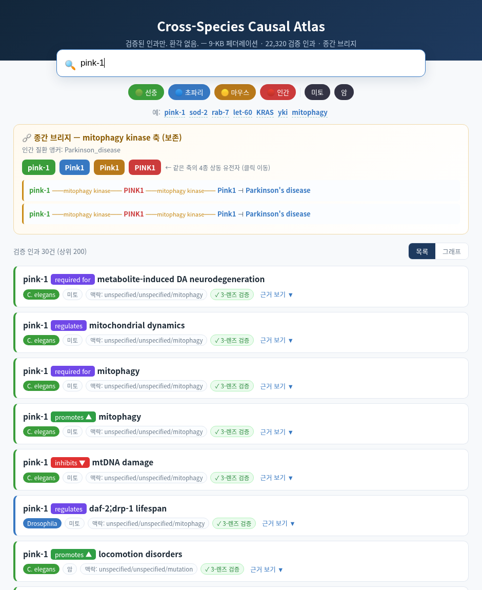
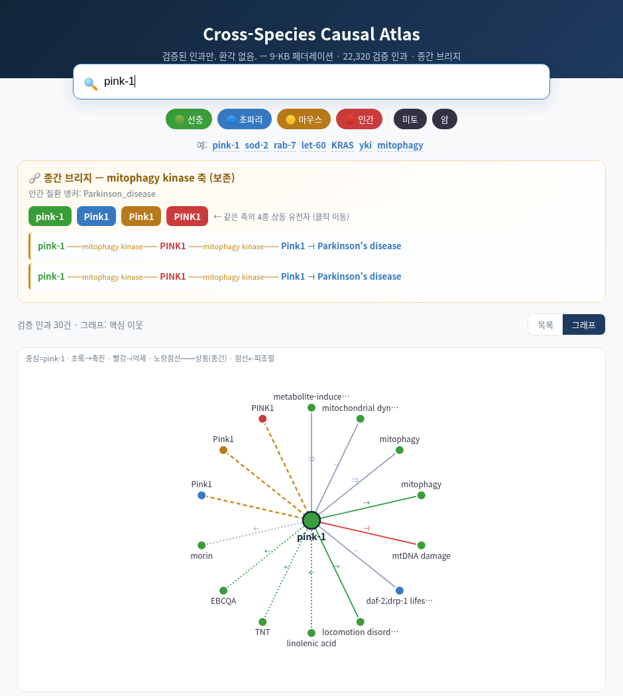

# Cross-Species Causal Atlas

**검증된 인과만. 환각 없음.** — 선충·초파리·마우스·인간을 잇는 신경-기호(neuro-symbolic)
지식그래프의 인터랙티브 탐색기.

### 🔗 라이브: **https://brigs1.github.io/causal-atlas/**

> 9-KB 페더레이션 · **22,320 검증 인과 엣지** · 미토콘드리아·암 각 4종 브리지

---

## 스크린샷

**검색 & 증명 + 종간 브리지** — 유전자를 검색하면 검증된 인과와 함께, 같은 축의 4종 상동
유전자와 종간 체인이 뜹니다.



**그래프 뷰** — 검색 유전자를 중심으로 인과 이웃(초록→촉진 · 빨강⊣억제)과 종간 상동
(노랑 점선)을 방사형으로 시각화.



---

## 무엇인가

일반 LLM은 *그럴듯한 답*을 빠르게 주지만, **출처·맥락·종간 안전성·반직관적 예외**가 필요한
순간 무너집니다. 이 앱은 그 반대를 지향합니다 — 모든 답이 **검증되고 추적 가능한 인과**입니다.

- **검색 & 증명:** 유전자·표현형 입력 → 인과 카드. "근거 보기"를 누르면 **원문 문장 + PubMed
  링크(PMID)** 가 열립니다.
- **🧠 자연어 질문:** "선충 rab-7은 암을 어떻게 억제하나?"처럼 물으면, **검증된 인과에서만**
  답을 생성하고 각 주장에 (PMID)를 인용합니다 — 근거 없으면 "근거 없음". (서버리스 Worker,
  API 키는 서버 시크릿; `WORKER_DEPLOY.md` 참고)
- **종간 브리지:** 검색어가 보존 축이면 **4종 상동 유전자 + 인간 질환 앵커 + 검증된 종간 체인**을
  자동 표시.
- **그래프 뷰:** 중심 유전자의 인과 이웃 + 종간 상동을 SVG로 탐색(노드 클릭 = 재검색).
- **필터:** 종(선충·초파리·마우스·인간) · 도메인(미토·암).

## 왜 신뢰할 수 있나 (vs 일반 LLM)

| 축 | 이 지식그래프 | 일반 LLM |
|---|---|---|
| 근거 | 원문 문장 + PMID | 없음(parametric) |
| 검증 | 3-렌즈(openai·anthropic·gemini) + 결정적 방향가드 | 자기확신, 검증 불가 |
| 맥락 | stage/tissue/condition 보존, 비호환 병합 차단 | 맥락 평균화·소실 |
| 종간 | 상동성 앵커로만 교차, 이름충돌 병합 0 | 파라로그·종 혼동 환각 |
| 추론 | 검증 엣지 위 결정적 BFS(추적 가능) | 그럴듯한 서사(재현 불가) |
| 반직관 사실 | 문헌의 예외·역설 포착 (예: `sod-2 ⊣ lifespan`) | '상식'으로 덮음 |

## 데이터

- **9-KB 페더레이션:** 미토 4종(선충·초파리·마우스·인간) + 암 4종 + 초파리 조혈.
- **22,320 검증 인과 엣지** (미토 11,709 + 암 10,611), 전부 근거문·PMID 보유.
- 종 노드는 네임스페이스로 분리 — 이름이 같아도 자동 병합되지 않으며, 교차는 오직 검증된
  보존 상동성 앵커(PINK1·KRAS·TP53·SOD2 …)로만.

## 기술

정적 단일 페이지. 데이터는 gzip(`kg.min.json.gz`)으로 배포되고 브라우저 네이티브
`DecompressionStream`으로 해제 — **외부 라이브러리 0**. 검색은 전부 클라이언트측.

## 로컬 실행

```bash
python -m http.server 8000
# http://localhost:8000/  접속 (fetch 때문에 file://은 불가 → HTTP 필요)
```

## 크레딧

factlog 신경-기호 지식그래프 데모. 각 인과 엣지는 문헌에서 추출되어 3-렌즈로 검증됩니다.
